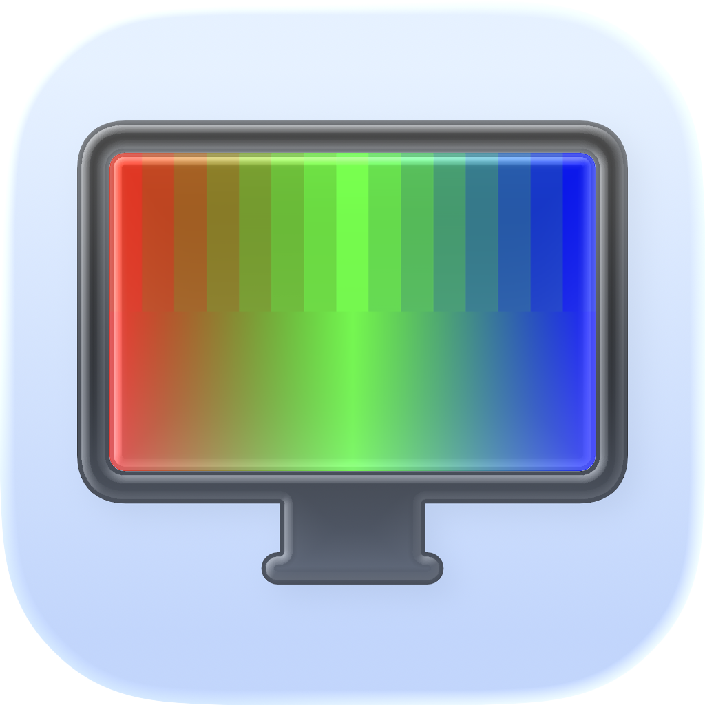
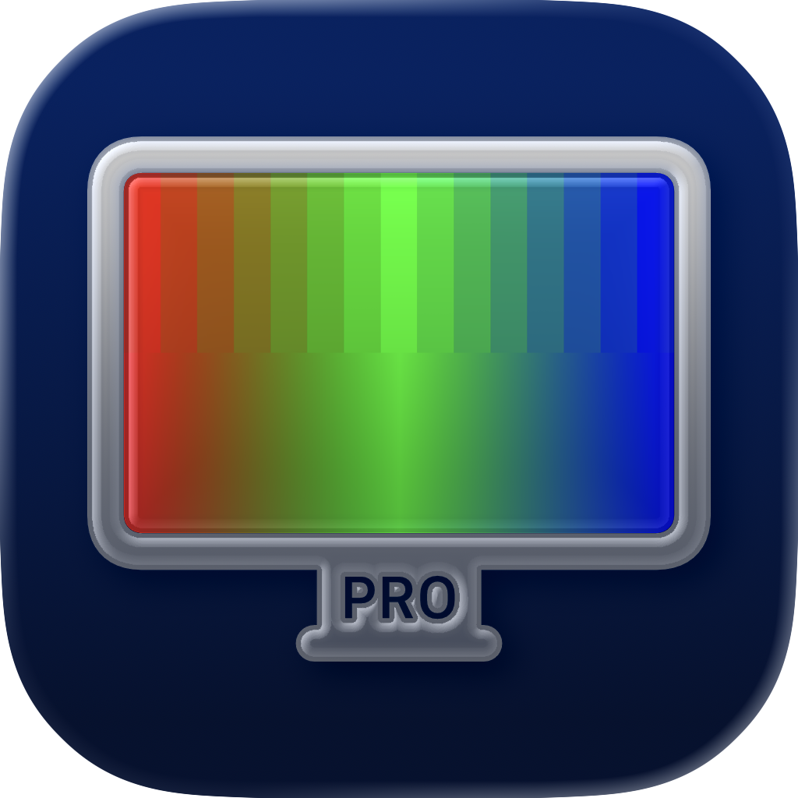
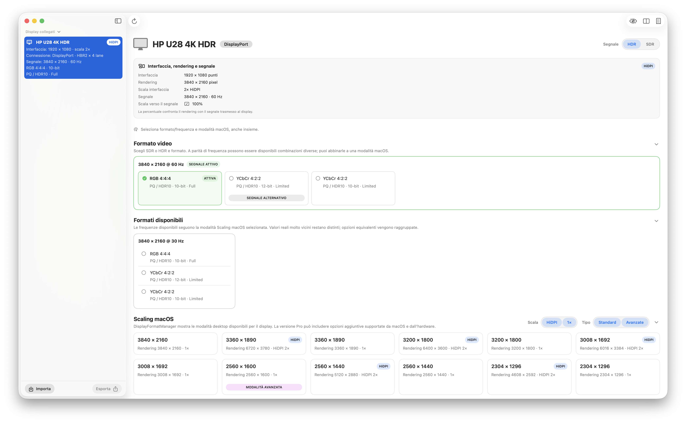
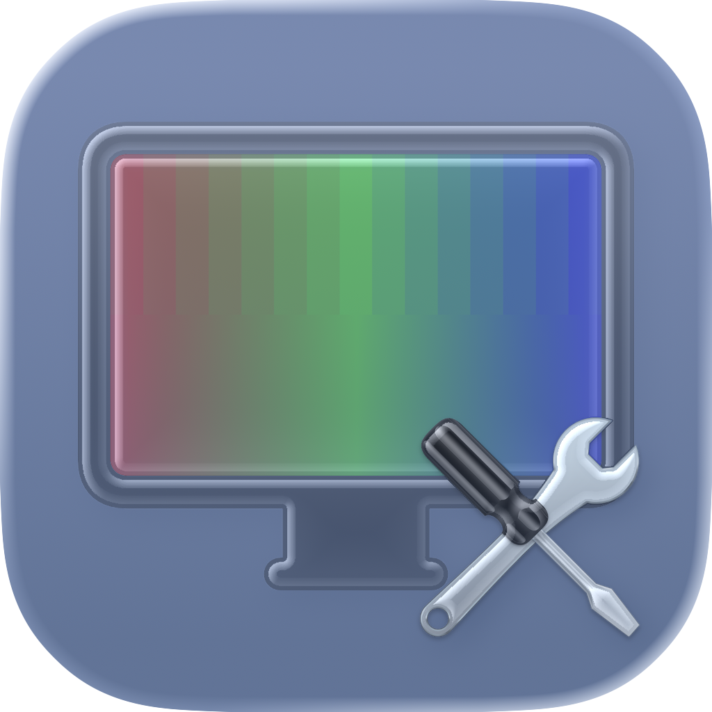

# DisplayFormatManager

  
  &nbsp;&nbsp;&nbsp;&nbsp;
  

  <strong>Take control of the video format macOS actually uses with your external display.</strong>

  <a href="#italiano">Italiano</a> ·
  <a href="#english">English</a>

---

# Italiano

## Cos'è DisplayFormatManager?

**DisplayFormatManager** è un'utility per macOS nata per rendere visibile e controllabile ciò che il sistema sta realmente facendo con un display esterno.

macOS normalmente decide autonomamente formato video, campionamento e altri parametri della connessione. In alcune configurazioni queste scelte possono risultare poco prevedibili e produrre fenomeni come **banding** o variazioni apparentemente inspiegabili nella qualità dell'immagine.

In attesa che Apple risolva definitivamente questi comportamenti, DisplayFormatManager prova a **metterci una toppa**. 😁

L'app permette di vedere il formato realmente utilizzato, intervenire sulle modalità disponibili, verificare il risultato e, quando necessario, mantenerlo nel tempo attraverso profili persistenti.

  

## Due edizioni

### DisplayFormatManager Base

La versione Base lavora principalmente **all'interno del timing video attualmente attivo**.

Permette di:
- visualizzare il formato e il campionamento realmente utilizzati da macOS;
- analizzare risoluzione, scaling e frequenza di aggiornamento;
- vedere la **connessione fisica** del display, ad esempio HDMI o DisplayPort;
- scegliere tra i formati compatibili disponibili per il timing corrente;
- provare temporaneamente una modifica prima di confermarla;
- effettuare automaticamente il rollback se la modifica non viene mantenuta;
- creare e gestire **profili persistenti locali**;
- sospendere e riattivare i profili;
- rilevare e mostrare Adaptive Sync / VRR quando è attivo;
- utilizzare la **Test Card integrata**;
- esportare un report della configurazione rilevata;
- organizzare le informazioni tramite sezioni collassabili.

La Base **non cambia la natura del timing attivo**: se il display è in SDR rimane in SDR; se è in HDR rimane in HDR.

Adaptive Sync / VRR può essere rilevato e visualizzato, ma non controllato direttamente.

I profili persistenti rimangono inoltre confinati all'interno dell'app e non possono essere esportati o importati.

### DisplayFormatManager Pro

**DisplayFormatManager Pro include tutto ciò che offre la Base**, aggiungendo il controllo di una parte molto più ampia della configurazione del display.

In più permette di:
- lavorare tra timing e configurazioni differenti;
- passare tra **SDR e HDR**;
- controllare in modo coordinato scaling, formato, campionamento e refresh rate;
- gestire **Adaptive Sync / VRR**, passando tra refresh fisso e variabile quando supportato;
- filtrare le modalità di scaling tra **1× e HiDPI**;
- filtrare separatamente le modalità tra **Standard e Avanzate**;
- visualizzare informazioni più tecniche tramite l'apposito controllo con l'**occhio**;
- memorizzare e ripristinare in modo più completo lo stato originale del display;
- esportare e importare i profili tramite file `.dfmprofile`;
- esportare più profili nello stesso preset;
- selezionare individualmente quali profili importare da un preset multiprofilo.

## Base vs Pro

| Funzione | Base | Pro |
|---|:---:|:---:|
| Formato e sampling effettivi | ✅ | ✅ |
| Risoluzione, scaling e refresh | ✅ | ✅ |
| Connessione fisica HDMI / DisplayPort | ✅ | ✅ |
| Test Card | ✅ | ✅ |
| Report | ✅ | ✅ |
| Sezioni collassabili | ✅ | ✅ |
| Applicazione temporanea + rollback | ✅ | ✅ |
| Profili persistenti | ✅ | ✅ |
| Adaptive Sync / VRR rilevato | ✅ | ✅ |
| Cambio SDR ↔ HDR | — | ✅ |
| Controllo Adaptive Sync / VRR | — | ✅ |
| Cambio tra timing differenti | — | ✅ |
| Filtri 1× / HiDPI | — | ✅ |
| Filtri Standard / Avanzate | — | ✅ |
| Informazioni tecniche aggiuntive | — | ✅ |
| Export / import `.dfmprofile` | — | ✅ |
| Preset multiprofilo | — | ✅ |
| Importazione selettiva | — | ✅ |
| Ripristino completo dello stato originale | — | ✅ |

## Scaling nella versione Pro

DisplayFormatManager Pro mette a disposizione due gruppi di filtri indipendenti.

**1× / HiDPI**
- **1×** — modalità senza scaling HiDPI;
- **HiDPI** — modalità in cui macOS effettua il rendering ad alta densità e scala il risultato verso il raster del display.

**Standard / Avanzate**
- **Standard** — modalità normalmente esposte e utilizzate da macOS;
- **Avanzate** — modalità reali e utilizzabili che DisplayFormatManager Pro riesce a rendere disponibili, ma che normalmente non compaiono nelle Impostazioni Schermi di macOS.

“Avanzata” non significa quindi sperimentale: indica una modalità valida che normalmente non viene presentata dall'interfaccia standard di macOS.

## Profili e preset

Entrambe le versioni supportano i **profili persistenti**. Nella Base rimangono locali all'app.

La Pro permette invece di esportarli e importarli attraverso il formato:

  

<code>.dfmprofile</code>

Un preset Pro può contenere un singolo profilo, più profili e configurazioni da importare selettivamente. I profili importati vengono inizialmente mantenuti sospesi, lasciando all'utente la scelta di quando attivarli.

## Test Card

Base e Pro includono una **Test Card integrata** per verificare direttamente sul display la resa della configurazione applicata.

## Report

Entrambe le edizioni possono esportare un report della configurazione rilevata. Il contenuto varia in base alle capacità dell'edizione utilizzata.

## Compatibilità

- **macOS 13 Ventura o successivo**
- **Mac con Apple Silicon**

> **Nota:** DisplayFormatManager non supporta la gestione dei display Apple, né integrati né esterni. Le funzioni di analisi e controllo sono destinate ai display esterni di terze parti compatibili.

Le modalità effettivamente disponibili dipendono dal display, dal collegamento utilizzato, dagli adattatori o dock eventualmente presenti e da ciò che macOS espone per quella specifica configurazione.

DisplayFormatManager **non crea modalità non supportate** dal display.

## Installazione

1. Scarica il DMG dell'edizione desiderata dalla sezione **Releases**.
2. Apri il file `.dmg`.
3. Trascina DisplayFormatManager nella cartella **Applicazioni**.
4. Avvia l'app.

Base e Pro sono firmate con **Apple Developer ID**, utilizzano **Hardened Runtime** e sono **notarizzate da Apple**. Anche i DMG distribuiti sono firmati e notarizzati.

I checksum SHA-256 ufficiali sono pubblicati insieme ai download.

## Perché esiste?

DisplayFormatManager nasce da un'esigenza personale e da oltre **due mesi di sviluppo, analisi, esperimenti e collaudi**.

Una parte consistente del lavoro non è consistita semplicemente nell'aggiungere funzioni, ma nel cercare di capire cosa macOS stesse realmente facendo dietro le quinte.

> **«Perché oggi macOS ha deciso di farlo funzionare diversamente da ieri?»**

Se Apple sistemerà definitivamente il problema, tanto meglio.

Nel frattempo, c'è DisplayFormatManager. 😁

## Ispirazione

Il progetto prende ispirazione in parte da **BetterDisplay**, per il livello di controllo offerto sui display in macOS, e in parte da **WhatCable**, per l'attenzione alle informazioni sulla connessione e a ciò che sta realmente accadendo tra Mac e display.

DisplayFormatManager è diventato, in un certo senso, un piccolo compendio di queste due idee, aggiungendo un proprio sistema di profili persistenti, Test Card, report e un'interfaccia pensata per essere il più possibile **chiara e amichevole**.

## Feedback

Se trovi un comportamento particolare, una configurazione insolita o qualcosa che potrebbe essere migliorato, puoi aprire una **GitHub Issue**.

## Release notes

- [Note di rilascio 1.0.0 — Italiano](RELEASE_NOTES_1.0.0_IT.md)
- [Release notes 1.0.0 — English](RELEASE_NOTES_1.0.0_EN.md)

## Licenza

I binari di DisplayFormatManager sono distribuiti secondo la [DisplayFormatManager Proprietary Binary License](LICENSE.md).

---

# English

## What is DisplayFormatManager?

**DisplayFormatManager** is a macOS utility designed to make what the system is actually doing with an external display more visible and controllable.

macOS normally chooses video format, sampling, and other connection parameters automatically. In some configurations these choices can be unpredictable and result in visible **banding** or seemingly inexplicable changes in image quality.

While waiting and hoping for Apple to address these behaviors once and for all, DisplayFormatManager tries to **put a patch over the problem**. 😁

It lets you inspect the format actually being used, work with the available modes, verify the result, and maintain a chosen configuration over time through persistent profiles.

  

## Two editions

### DisplayFormatManager Base

The Base edition works primarily **within the currently active video timing**.

It can:
- show the format and sampling actually used by macOS;
- analyze resolution, scaling, and refresh rate;
- show the display's **physical connection**, such as HDMI or DisplayPort;
- choose among compatible formats available for the current timing;
- temporarily test a change before confirming it;
- automatically roll back when a change is not kept;
- create and manage **local persistent profiles**;
- suspend and reactivate profiles;
- detect and display Adaptive Sync / VRR when active;
- use the integrated **Test Card**;
- export a report of the detected configuration;
- organize information into collapsible sections.

Base **does not change the nature of the active timing**: SDR remains SDR, and HDR remains HDR.

Adaptive Sync / VRR can be detected and displayed but is not directly controlled.

Persistent profiles also remain local to the app and cannot be exported or imported.

### DisplayFormatManager Pro

**DisplayFormatManager Pro includes everything available in Base**, while adding control over a much broader part of the display configuration.

It additionally supports:
- working across different timings and configurations;
- switching between **SDR and HDR**;
- coordinating scaling, format, sampling, and refresh rate;
- controlling **Adaptive Sync / VRR**, switching between fixed and variable refresh when supported;
- filtering scaling modes between **1× and HiDPI**;
- independently filtering modes between **Standard and Advanced**;
- displaying additional technical information through the dedicated **eye** control;
- more completely capturing and restoring the display's original state;
- exporting and importing profiles through `.dfmprofile` files;
- exporting multiple profiles in a single preset;
- selectively importing individual profiles from a multi-profile preset.

## Base vs Pro

| Feature | Base | Pro |
|---|:---:|:---:|
| Actual format and sampling | ✅ | ✅ |
| Resolution, scaling, refresh | ✅ | ✅ |
| Physical HDMI / DisplayPort connection | ✅ | ✅ |
| Test Card | ✅ | ✅ |
| Reports | ✅ | ✅ |
| Collapsible sections | ✅ | ✅ |
| Temporary application + rollback | ✅ | ✅ |
| Persistent profiles | ✅ | ✅ |
| Adaptive Sync / VRR detection | ✅ | ✅ |
| SDR ↔ HDR switching | — | ✅ |
| Adaptive Sync / VRR control | — | ✅ |
| Switching between different timings | — | ✅ |
| 1× / HiDPI filters | — | ✅ |
| Standard / Advanced filters | — | ✅ |
| Additional technical information | — | ✅ |
| `.dfmprofile` export / import | — | ✅ |
| Multi-profile presets | — | ✅ |
| Selective import | — | ✅ |
| Complete original-state restoration | — | ✅ |

## Scaling in Pro

DisplayFormatManager Pro provides two independent groups of filters.

**1× / HiDPI**
- **1×** — modes without HiDPI scaling;
- **HiDPI** — modes where macOS renders at high density and scales the result to the display raster.

**Standard / Advanced**
- **Standard** — modes normally exposed and used by macOS;
- **Advanced** — real, usable modes that DisplayFormatManager Pro can expose even though they normally do not appear in macOS Display Settings.

“Advanced” therefore does not mean experimental. It identifies a valid mode outside the selection normally presented by the standard macOS interface.

## Profiles and presets

Both editions support **persistent profiles**. In Base, profiles remain local to the app.

Pro makes them portable through the format:

  

<code>.dfmprofile</code>

A Pro preset can contain one profile, multiple profiles, and configurations that can be selectively imported. Imported profiles are initially kept suspended, leaving the user in control of when to activate them.

## Test Card

Both Base and Pro include an integrated **Test Card** for visually checking the result of an applied display configuration.

## Reports

Both editions can export a report containing the detected display configuration. The contents reflect the capabilities of the edition in use.

## Compatibility

- **macOS 13 Ventura or later**
- **Apple Silicon Mac**

> **Note:** DisplayFormatManager does not support managing Apple displays, whether built-in or external. Its analysis and control features are intended for compatible third-party external displays.

The modes actually available depend on the display, the connection being used, any adapter or dock in the chain, and what macOS exposes for that specific configuration.

DisplayFormatManager **does not create unsupported display modes**.

## Installation

1. Download the DMG for the edition you want from **Releases**.
2. Open the `.dmg`.
3. Drag DisplayFormatManager into **Applications**.
4. Launch the app.

Both Base and Pro are signed with **Apple Developer ID**, built with **Hardened Runtime**, and **notarized by Apple**. The distributed DMGs are signed and notarized as well.

Official SHA-256 checksums are published alongside the downloads.

## Why does it exist?

DisplayFormatManager started from a personal need and represents more than **two months of development, analysis, experiments, and testing**.

A significant part of the work was not simply adding features, but figuring out what macOS was actually doing behind the scenes.

> **“Why did macOS decide to make it work differently today than it did yesterday?”**

If Apple eventually fixes the underlying problem, all the better.

Until then, there is DisplayFormatManager. 😁

## Inspiration

The project takes inspiration partly from **BetterDisplay**, for the level of display control it provides on macOS, and partly from **WhatCable**, for its focus on connection information and on understanding what is actually happening between the Mac and the display.

In a way, DisplayFormatManager became a small synthesis of those two ideas, adding its own persistent-profile system, Test Card, reports, and an interface designed to remain as **clear and approachable** as possible.

## Feedback

If you encounter unusual behavior, a particular configuration, or something that could be improved, feel free to open a **GitHub Issue**.

## Release notes

- [Note di rilascio 1.0.0 — Italiano](RELEASE_NOTES_1.0.0_IT.md)
- [Release notes 1.0.0 — English](RELEASE_NOTES_1.0.0_EN.md)

## License

DisplayFormatManager binaries are distributed under the [DisplayFormatManager Proprietary Binary License](LICENSE.md).
